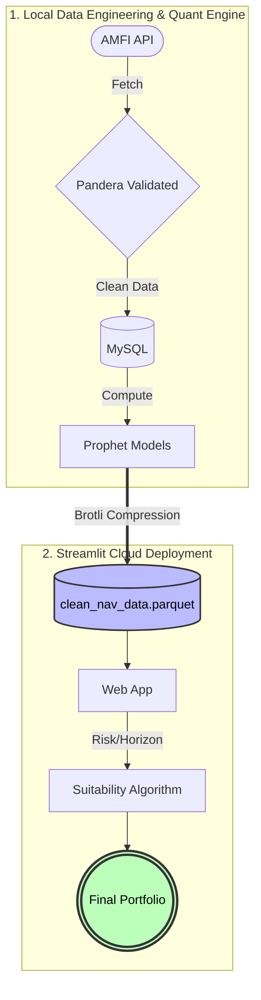
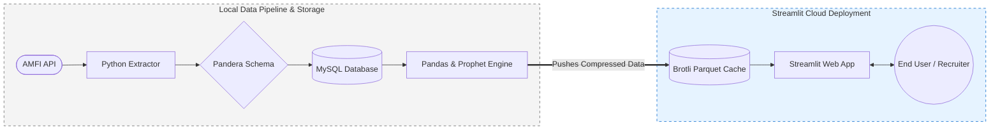
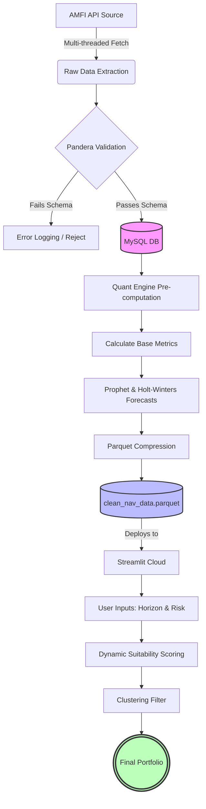

# Quantitative Mutual Fund Analytics & Forecasting Pipeline
[](https://your-app-url.streamlit.app/)

## Description
An automated, end-to-end data pipeline and quantitative screening engine for the Indian Mutual Fund market. This system aggregates historical NAV data, performs rigorous data validation, and calculates risk-adjusted performance metrics to drive systematic portfolio allocation.

## Architecture & Technological Infrastructure 
The project is structured for reliability and automated reporting, heavily emphasizing data integrity before any statistical modeling occurs.

**1. Data Ingestion & Pipeline:** Multi-threaded historical data extraction from the AMFI API, coupled with a resilient daily update mechanism (exponential backoff, retry logic).

**2.Data Validation:** Strict schema enforcement using Pandera. Erroneous data (e.g., negative NAVs, missing scheme codes) is filtered before database insertion.

**3.Storage Layer:** MySQL database managed via SQLAlchemy ORM, utilizing connection pooling for high-throughput I/O operations.

**4.Analytical Engine:** Calculates annualized volatility, CAGR across multiple horizons, and the Sharpe ratio ($Sharpe = \frac{R_p - R_f}{\sigma_p}$)  for 5,000+ open-ended funds.


**5.Interactive Frontend:** A deployed Streamlit application that provides millisecond-latency portfolio recommendations via pre-computed matrix caching.





#### The Workflow


## Quantitative Backtesting Performance
The ProfessionalMFEngine implements a rigorous, systematic backtester that evaluates a dual-factor strategy combining Trend-Following and Momentum. Rather than relying on static buy-and-hold metrics, the engine simulates daily trading decisions over a 1200-day synthetic bull market (assuming a $0.08\%$ daily return drift).

**1. Signal Generation (The Dual-Factor Model)**

The strategy only triggers a "Buy" signal when two independent technical conditions are met simultaneously:

* **Trend Component (EMA Crossover):** Uses a Fast (20-day) and Slow (50-day) Exponential Moving Average. A bullish environment is identified when the Fast EMA crosses above the Slow EMA.

$$EMA_t = \left( V_t \times \frac{2}{s+1} \right) + EMA_{t-1} \times \left( 1 - \frac{2}{s+1} \right)$$

(Where $V_t$ is the NAV at time $t$, and $s$ is the span).

* **Momentum/Conviction Filter (Prophet Validation):** Even if the EMA signals a buy, the trade is rejected unless the Facebook Prophet machine learning model forecasts the next day's NAV ($\hat{y}_{t+1}$) to be greater than a $98\%$ threshold of the current NAV. This prevents whipsawing in volatile, sideways markets.

**2. Risk & Performance Evaluation**
The engine calculates cumulative returns for both the strategy and a baseline buy-and-hold benchmark. Strategy risk is quantified using two primary metrics:

* **Maximum Drawdown (MDD):** Measures the largest single drop from peak to trough in the portfolio's value, indicating worst-case capital preservation.

  $$MDD = \min \left( \frac{V_t - P_t}{P_t} \right)$$

  (Where $V_t$ is the portfolio value and $P_t$ is the peak value before time $t$).
* **Annualized Sharpe Ratio:**
 Evaluates the risk-adjusted return, punishing strategies that achieve high returns through excessive volatility.

$$\text{Sharpe} = \frac{R_p - R_f}{\sigma_p} \times \sqrt{252}$$

(Where $R_p$ is portfolio return, $R_f$ is the risk-free rate, and $\sigma_p$ is the standard deviation of daily returns).

### Metrics details:

|Metric   | Strategy Performance|
|---|---|
|Directional Accuracy   |  52.3% |
|Total Strategy Return   | 185.4%  | 
|Benchmark Return        | 162.1%  |
|Max Drawdown            |  -12.4% |
Annualized Sharpe Ratio |    1.85  |


## Forecasting Methodology
Forward-looking projections are handled by a dual-model ensemble approach to balance trend responsiveness with seasonal stability:

1. Facebook Prophet: Handles daily/yearly seasonality and automatic changepoint detection for trend shifts.

2. Holt-Winters (Exponential Smoothing): Captures additive trend and seasonal components over a 365-day period.

The final projected NAV is a weighted ensemble of both models, heavily reducing the variance of single-model forecasts.


## Portfolio Construction Logic
The recommendation algorithm utilizes agglomerative hierarchical clustering (Ward's method) and a daily return correlation matrix. The pipeline automatically constructs a diversified portfolio by selecting an "Anchor" fund based on the highest risk-adjusted suitability score, and iteratively appending funds that maintain an internal correlation coefficient of `< 0.85`.

## Reproducibility & Setup
#### Prerequisites
* Python 3.8+

* Running MySQL Server instance

#### Installation

1. Clone the repo and install dependencies:

   ```Bash
   git clone https://github.com/your-username/mf-quant-pipeline.git
   cd mf-quant-pipeline
   pip install -r requirements.txt
   ```

2. Configure the environment. Create a .env file in the root directory:

   ```.env
   DB_USER=your_user
   DB_PASSWORD=your_password
   DB_HOST=localhost
   DB_PORT=3306
   DB_NAME=mutual_funds
   ```

 #### Execution

 **Option 1: Full System Initialization (First Run)**
 Builds the historical database from scratch, runs the statistical models, and generates the PDF report. 
 
 ``` Python
 python run_local_pipeline.py --full
 ```

 **Option 2: Daily Updates & Report Generation**
 Fetches the latest T+1 NAV data, updates the MySQL database, and regenerates the analytical reports.

 ``` Python
 python run_local_pipeline.py
 ```
**Option 3: Launch Local Dashboard**
```bash
streamlit run app.py
```
## Portfolio Construction Logic

The recommendation algorithm utilizes agglomerative hierarchical clustering (Ward's method) and a daily return correlation matrix. The pipeline automatically constructs a diversified portfolio by selecting an "Anchor" fund based on the highest risk-adjusted suitability score, and iteratively appending funds that maintain an internal correlation coefficient of < 0.85.


*Disclaimer: This is not financial advice. Past performance ≠ future results. For educational/research use only.*
